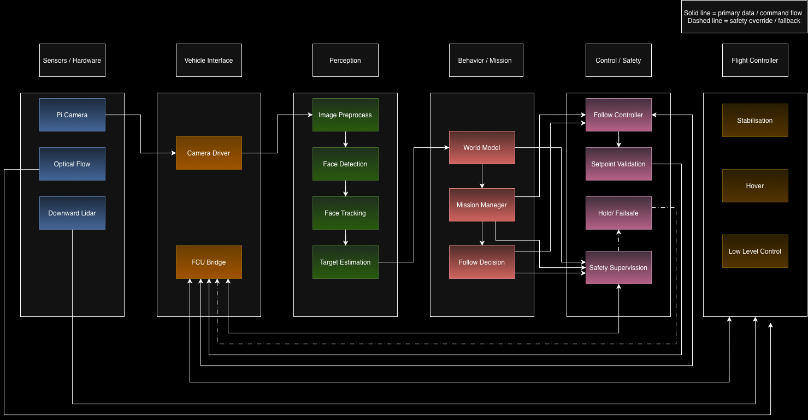
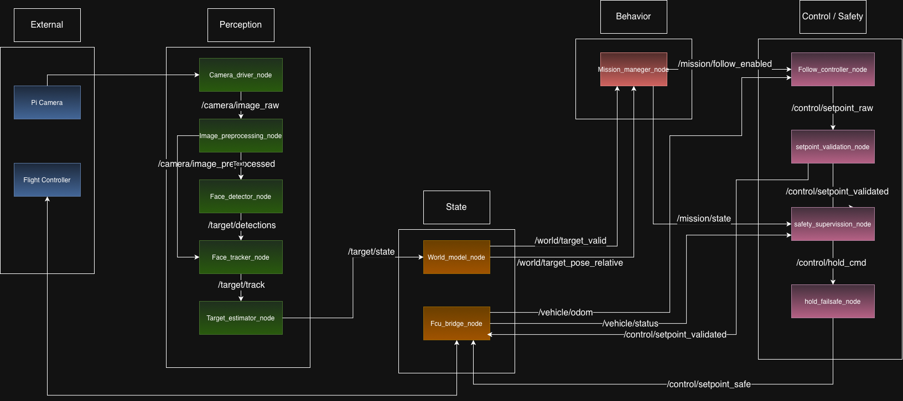

# DIY Indoor Face-Following Drone  
**ROS 2 Jazzy · Raspberry Pi 4 · OpenCV · Docker · C++17**

A modular ROS 2 drone autonomy stack for an indoor **face-following drone**, designed around a **Raspberry Pi 4 companion computer** and a separate **Flight Controller (FC)** for stabilization and low-level control.

The long-term goal is a real indoor drone that can detect a person’s face, estimate relative target position, decide when to follow, and send safe high-level motion commands to the FC.

The project is currently in a **software architecture sprint**, using a `mock_fcu_node` to validate the full autonomy pipeline.

---

## Project Goal

This project is being built as a serious robotics/software engineering portfolio piece with a strong focus on:

- clean ROS 2 architecture
- modular package design
- safety-aware control flow
- hardware/software separation of concerns
- reproducible development in Docker
- step-by-step integration from mock environment to real hardware

**Current milestone:**  
**Target in → yaw command out via mock FCU**

That means the current focus is not perfect AI tracking or full flight autonomy yet — it is to get the **architecture working end-to-end**.

---

## System Overview

The Raspberry Pi runs all **high-level autonomy**:

- perception
- world modeling
- mission logic
- control
- safety supervision

The Flight Controller remains responsible for all **low-level flight-critical loops**:

- stabilization
- hover
- motor control
- optical flow handling
- downward lidar/rangefinder handling

This separation is intentional. ROS 2 does **not** replace the FC.

### High-Level System Architecture



### ROS 2 Node / Topic Architecture



---

## Key Engineering Decisions

### 1. The FCU bridge is the only gateway
All communication between ROS and the Flight Controller must go through `fcu_bridge_node`.

This keeps the integration boundary clean and prevents control logic, safety logic, and hardware communication from becoming tightly coupled.

### 2. Safety has veto power
Safety is not treated as a side feature.  
A safety node can override normal mission behavior and force a hold/failsafe state at any time.

### 3. ROS sends high-level setpoints only
ROS generates commands such as:

- `vx`
- `vy`
- `vz`
- `yaw_rate`

The FC is still responsible for the fast inner loops and stabilization.

### 4. Optical flow and downward lidar stay on the FC
These sensors are stability-critical and should remain on the flight controller instead of being pulled into the companion computer stack.

---

## Current Status

### Implemented
- Custom ROS 2 message package: `drone_interfaces`
- `mock_fcu_node`
- `world_model_node`
- `vision_node` using Haar Cascade face detection
- Docker-based ROS 2 Jazzy development environment
- System architecture and ROS graph design

### In Progress / Next
- `mission_manager_node`
- `follow_controller_node`
- `setpoint_validation_node`
- launch setup for the full mock chain
- safety nodes
- full perception pipeline
- real `fcu_bridge_node` once replacement FC hardware arrives

---

## Repository Structure

```text
Drone/
├── README.md
├── CLAUDE.md
├── docs/architecture/
│   ├── ROS_architecture-3.drawio
│   ├── ROS_architecture.drawio-3.png
│   ├── System_Overview-2.drawio
│   └── System_Overview.drawio.png
├── hardware/
└── software/
    ├── Dockerfile
    ├── compose.yml
    └── drone_ws/src/
        ├── drone_interfaces/
        ├── drone_state/
        ├── drone_vision/
        ├── drone_control/
        ├── drone_behavior/
        ├── drone_bringup/
        ├── drone_perception/
        ├── drone_safety/
        ├── drone_sim/
        ├── drone_description/
        └── drone_test/
